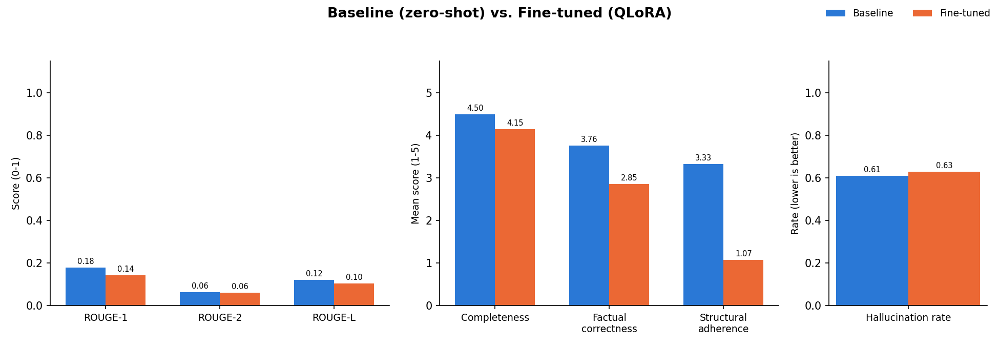

# Baseline vs. Fine-Tuned Comparison Report

Generated: 2026-08-03T19:44:20.024367+00:00

- Baseline: `NousResearch/Meta-Llama-3-8B-Instruct` (400 examples, 400 judged)
- Fine-tuned: `/content/drive/MyDrive/ambient-clinical-scribe-llm/models/merged` (400 examples, 400 judged)
- LLM judge: `gemini-flash-lite-latest`

## Metric comparison

| Metric | Baseline | Fine-tuned | Δ |
|---|---|---|---|
| ROUGE-1 | 0.178 | 0.141 | -0.036 (▼ worse) |
| ROUGE-2 | 0.061 | 0.061 | -0.001 (▼ worse) |
| ROUGE-L | 0.120 | 0.103 | -0.017 (▼ worse) |
| Completeness (1-5, LLM judge) | 4.50 | 4.15 | -0.35 (▼ worse) |
| Factual correctness (1-5, LLM judge) | 3.76 | 2.85 | -0.91 (▼ worse) |
| Structural adherence (1-5, LLM judge) | 3.33 | 1.07 | -2.26 (▼ worse) |
| Hallucination rate (LLM judge) | 60.9% | 63.0% | +2.1% (▼ worse) |

## Hallucination check

Hallucination rate increased (60.9% -> 63.0%), though ROUGE did not improve alongside it.

## Chart

## Notes

- ROUGE is computed against the human-written reference note for each dialogue.
- LLM-judge scores are computed against the source dialogue transcript, not the reference
  note (see src/eval/llm_judge.py) -- the reference is context, not ground truth, so the
  judge does not penalize a note for being faithful to the dialogue but phrased differently.
- This report reflects whatever result files were present when it was generated. Re-run
  `python -m src.eval.generate_report` after any new eval or judge run to refresh it.
